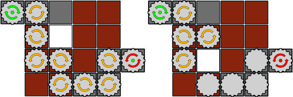
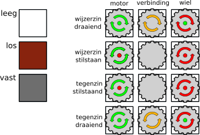
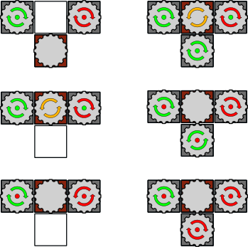
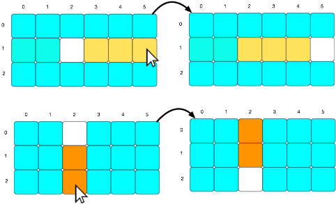

# Pipes

Voor dit project laten we ons inspireren door het puzzelspel [Cogs]. In onze
versie laten we de gebruiker 2-dimensionale schuifpuzzels oplossen. Je moet
echter geen afbeelding in elkaar schuiven, maar een netwerk van tandwielen.

## Omschrijving van de puzzel

### De stukken

Een schuifpuzzel bestaat uit een vaste rand, op één plekje (de opening) na,
gevuld met vierkante tegels. Op de rand bevinden zich een aantal motoren
("sources") en een aantal wielen ("sinks").

De tegels binnenin de rand kunnen ofwel beweegbaar zijn (bruine achtergrond),
ofwel vast liggen (grijze achtergrond). Een beweegbare tegel kan je in elke
richting schuiven, als er plaats is, maar nooit draaien. Vaste tegels kan je
noch verschuiven noch draaien.

Bovenaan een tegel kan er een tandwiel hangen. Die tandwiel kan al-dan-niet in
beweging zijn, afhankelijk van het netwerk. De tandwielen op motoren en wielen
kunnen slechts in één richting draaien. De tandwielen binnenin de rand kunnen
in beide richtingen draaien (maar natuurlijk slechts één tegelijk).

### Opgelost of niet?

Een puzzel is opgelost als elk wiel draait in de richting die het aangeeft. Dit
wordt aangegeven door de stip middenin het wiel, die groen wordt.

Om de wielen te laten draaien maak je een verbinding met een motor. Een
verzameling van tandwielen die (onrechtstreeks) met elkaar verbonden zijn
noemen we een netwerk. Een netwerk zal draaien als er minstens evenveel motoren
als wielen in aanwezig zijn en er geen blokkering in aanwezig is.

Een netwerk zal niet blokkeren als je aan elk tandwiel een zin kan toekennen
(wijzerzin of tegenzin) zonder twee adjacente tandwielen dezelfde zin te geven.
Hierbij moeten motoren en wielen hun opgelegde zin krijgen.

* **Linksboven**: alle tandwielen bevinden zich in een apart netwerk, enkel dat
  van de motor draait.

* **Linksmidden**: de drie tandwielen zitten in één netwerk, met evenveel
  motoren als wielen en geen blokkeringen. Geldige oplossing.

* **Linksonder**: de drie tandwielen zitten in één netwerk, met evenveel
  motoren als wielen. Het netwerk is geblokkeerd: als we het middelste tandwiel
  wijzerzin laten draaien, draait het in dezelfde zin als zijn linkerbuur. Als
  we het tegenzin laten draaien, zou de motor in de foute zin moeten draaien.
  Geen enkel tandwiel in het netwerk zal draaien (we zien dan ook rode stippen
  op de motor en het wiel, en geen zinaangeving op het middelste tandwiel).

* **Rechtsboven**: Eén netwerk, meer motoren dan wielen, geen blokkering.
  Geldige oplossing.

* **Rechtsmidden**: Eén netwerk, maar we kunnen geen zin toekennen aan het
  middelste tandwiel zodat het met beide motoren mee draait.

* **Rechtsonder**: Eén netwerk, geen blokkering, maar onvoldoende motoren.

### Invoerformaat

Een wereld wordt omschreven door een bestand dat er als volgt uitziet:

    width: 4
    height: 3
    sources: { { (-1, -1), clockwise }, { (-1, 0), counter clockwise } }
    sinks: { { (3, 3), clockwise } }
    tiles: { { pos: (0, 0), fixed: no, wheel: no }
           , { pos: (0, 2), fixed: no, wheel: no }
           , { wheel: yes, pos: (0, 3), fixed: yes }
           , { pos: (1, 0), fixed: no, wheel: no }
           , { pos: (1, 1), wheel: no, fixed: no }
           , { pos: (1, 2), fixed: no, wheel: yes }
           , { fixed: no, pos: (1, 3), wheel: no }
           , { pos: (2, 0), fixed: yes wheel: yes }
           , { pos: (2, 1), fixed: no, wheel: no }
           , { pos: (2, 2), fixed: no, wheel: yes }
           , { pos: (2, 3), fixed: no, wheel: no }
           }

Enkele algemene omschrijvingen van dit formaat:

* Witruimte, tenzij anders vermeld, bestaat uit horizontale witruimte (spaties
  en tabs) en verticale witruimte (nieuwe regels).

* Een sleutel en zijn waarde worden van elkaar gescheiden door een dubbelpunt
  en horizontale witruimte.

* Een lijst van waarden wordt voorgesteld door de voorstelling van deze waarden,
  voor en na elke waarde optioneel witruimte, gescheiden door 1 komma en omringd
  door accolades (`{` vooraan en `}` achteraan de lijst).

* Een coördinaat wordt voorgesteld door twee gehele getallen. Het eerste getal
  stelt de rij voor, het tweede de kolom. De oorsprong `(0, 0)` bevindt zich
  linksboven *binnen* de rand. Tussen de twee getallen staat een komma. Na het
  linkerhaakje, voor de komma, na de komma en voor het rechterhaakje staat
  optioneel horizontale witruimte.

Het formaat zelf:

* Een eerste sleutel "width" met als waarde een geheel getal groter dan 0 stelt 
  de breedte van de puzzel voor (rand niet meegerekend). Gevolgd door een
  nieuwe regel.

* Een tweede sleutel "height" met als waarde een geheel getal groter dan 0 stelt
  de hoogte van de puzzel voor (rand niet meegerekend). Gevolgd door een
  nieuwe regel.

* Een derde sleutel "sources" met als waarde een lijst van motoren. Elke motor
  is zelf een lijst met als eerste element een coördinaat (de locatie van de
  motor) en als tweede element een zin (ofwel "clockwise" ofwel "counter
  clockwise", die aangeven of de motor in wijzerzin of tegenzin aandrijft).

  Er is altijd minstens 1 motor aanwezig.

* Een vierde sleutel "sinks" die gelijkaardig aan de "sources" de lijst van
  wielen omschrijft.

  Er is altijd minstens 1 wiel aanwezig.

* Een vijfde sleutel "tiles" die een lijst van tegels als waarde heeft. Een
  tegel wordt voorgesteld door een lijst van sleutel/waarde-paren in arbitraire
  volgorde:

  - Een verplichte sleutel "pos" met als waarde de coördinaat van deze tegel.
  - Een optionele sleutel "fixed" met als waarde "yes" of "no", die aangeeft of
    deze tegel een vaste of verschuifbare tegel is. Bij afwezigheid is de tegel
    verschuifbaar.
  - Een optionele sleutel "geared" met als waarde "yes" of "no", die aangeeft
    of er aan deze tegel een tandwiel hangt. Bij afwezigheid hangt er geen
    tandwiel aan de tegel.

  Er is altijd minstens 1 tegel aanwezig.

Invoer kan geldig zijn (volgens bovenstaande beschrijving) of ongeldig
(anders). Jullie programma moet alle geldige invoer aanvaarden en alle
ongeldige invoer weigeren. Bij onduidelijkheid of iets geldig of ongeldig is,
stuur je een voorbeeld door, waarop ik het zal uitklaren.

## Interface

### Grafisch

Het spel wordt opgestart met een oproep

    stack build --exec 'pipes tests/1.in'

Je speelt het spel door met de muis te klikken op tegels. Klikt de speler op
een tegel op dezelfde rij/kolom als de opening, schuiven alle tegels van de
aangeklikte tegel tot de opening 1 vakje op richting de opening. De nieuwe
opening bevindt zich dan waar de speler klikte. Lukt de gevraagde zet niet,
bijvoorbeeld omdat er een vast vakje tussen de opening en de aangeklikte tegel
lag, of omdat de aageklikte tegel zich niet op dezelfde rij/kolom bevindt als
de opening, wordt de klik gewoon genegeerd.

Hieronder vind je twee voorbeelden hoe de interactie werkt.

Naast het afbeelden van de tegels, moet je ook nog de motoren en de wielen
weergeven. Beide moeten kunnen weergeven in welke zin het tandwiel kan draaien
en of het aan het draaien is.

Een opgeloste puzzel hoef je niet grafisch speciaal weer te geven, die kan je
herkennen omdat alle wielen aan het draaien zijn.

### Testen (CLI)

Een test wordt opgestart met een oproep

    stack build --exec 'pipes --test tests/1.in'

Deze oproep geeft weer of de gegeven puzzel geldig, correct opgelost of niet
correct opgelost is:

    $ stack build --exec 'pipes --test tests/1.in'
    INVALID
    $ stack build --exec 'pipes --test tests/2.in'
    SOLVED
    $ stack build --exec 'pipes --test tests/3.in'
    NOT SOLVED

Enkele voorbeeldwerelden zijn beschikbaar in de [tests](tests) map.

## Vereisten

We voorzien minimale functionele vereisten en uitgebreide functionele
vereisten. Voldoet je project niet aan de minimale functionele vereisten heb je
automatisch een nul voor het project. Indien je in tijdsnood zou raken is het
dus belangrijker om te focussen op het correct implementeren van de spellogica
dan op het voorzien van een grafische interface. Daarnaast vragen we ook nog
enkele niet-functionele vereisten.

### Minimale Functionele vereisten

* Je code moet het invoerformaat kunnen parsen.
* Je code moet minstens slagen voor de voorziene testbestanden.

### Verdere Functionele vereisten 

* Je code moet een grafische interface voorzien.
* Je code moet slagen voor een reeks van uitgebreide tests.

### Niet-functionele vereisten

* De parser moet geschreven worden met een eigen geschreven parser monad, je
  mag hiervoor beginnen van de parser monad die je hebt gezien tijdens de
  hoorcolleges.
* De parser moet gebruik maken van een error monad om behulpzame parse-fouten
  weer te geven.
* Je dient zelf testen te schrijven die de werking van het spel testen. Je kan
  hier werken met:
  - testen zoals in Sausage Roll
  - [HUnit](https://hackage.haskell.org/package/HUnit), Java-style testen.
  - [QuickCheck](https://hackage.haskell.org/package/QuickCheck)
  - gewoon elke combinatie van bovenstaande gebruiken.
* Je grafische interface moet geïmplementeerd worden met gloss.
* Geen hardgecodeerde constanten in je code.
* Vermijd het gebruik van if-testen, maak gebruik van pattern matching en
  guards.
* Maak gebruik van where clauses voor locale functies.
* Probeer gebruik te maken van de reeds bestaande functies.
* Pas hlint toe op je code.

Voldoet je code niet aan de verwachte code stijl zal je hiervoor punten
verliezen.

## Praktisch

Dien in door je project gezipt op te laden naar [indianio].  Wegens gebrek
aan ondersteuning voor Haskell, zal Indianio **niet** controleren of
jouw code compileert, dit kan je zelf doen door met een stack project
te werken (dien je aangepaste metafiles mee in!).

Om ons werk te sparen tijdens het verbeteren, zorgen jullie er zelf voor dat
jullie projecten compileren. **Projecten die niet compileren krijgen
automatisch een nul.** Om een "maar op mijn machine werkte het wel..." te
vermijden, kan je altijd je project eens compileren in de standaard Haskell
docker. Loop onderstaand commando met je project als huidige map.

    docker run -it -v $(pwd):/mnt --workdir=/mnt --rm haskell:8 bash -c 'apt-get update; yes | apt-get install freeglut3-dev; stack build --allow-different-user'

Problemen kan je altijd (voor de deadline) melden.

## Dependencies

In dit project maken we opnieuw gebruik van [gloss], en deze werd al toegevoegd
aan het gegeven cabal bestand. Gebruik je andere bibliotheken, dan voeg je die
ook daar toe (en je dient deze mee in). Vermijd het gebruik van ongeziene
bibliotheken, bij twijfel vraag je even of je jouw favoriete bibliotheek mag
gebruiken.

[indianio]: https://indianio.ugent.be/?action=handinform&id=13671
[gloss]: http://hackage.haskell.org/package/gloss
[Cogs]: http://www.cogsgame.com/
